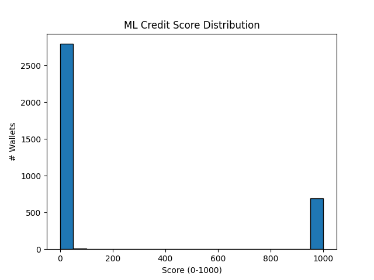

# Wallet Scoring with Machine Learning

This project applies a machine learning-based pipeline to assign a credit-like score (0–1000) to wallets based on their transaction behaviors. The output score distribution is visualized to evaluate scoring trends and anomalies.

---

## 📁 Folder Structure

wallet_scoring/
├── data/
│ └── sample_user_transactions.json # Raw user transaction data
├── src/
│ ├── init.py
│ ├── extract_features.py # Feature extraction logic
│ └── score_wallets_ml.py # ML scoring pipeline
├── wallet_scores_ml.csv # Generated wallet scores
├── score_distribution_ml.png # Histogram of scores
├── requirements.txt # Dependencies list
├── README.md # Project overview (this file)
└── analysis.md # Analysis of score distribution


---

## 📊 Goal

To assign a **ML-driven credit score** to each wallet using behavioral features from transaction data, mimicking a financial credit scoring system.

---

## ⚙️ Workflow

1. **Input Data**  
   JSON file containing user wallet transactions.
   
2. **Feature Engineering** (`extract_features.py`)  
   Extract features like:
   - Transaction frequency
   - Avg. transaction value
   - Volatility in spend
   - Transaction diversity, etc.

3. **ML Pipeline** (`score_wallets_ml.py`)  
   - Preprocess data
   - Fit a basic ML model (e.g., Isolation Forest)
   - Normalize score between 0–1000
   - Save results as CSV
   - Plot score distribution

---

## 🔍 Sample Output

- **wallet_scores_ml.csv**: Scores for each wallet  
- **score_distribution_ml.png**: Histogram of scores  
  

---

## 🧪 Dependencies

Install all required packages with:

```bash
pip install -r requirements.txt


Future Improvements
Replace IsolationForest with supervised learning using labeled defaults

Integrate risk-profile clustering

Build a Flask API for real-time scoring

Deploy on cloud for scalability

